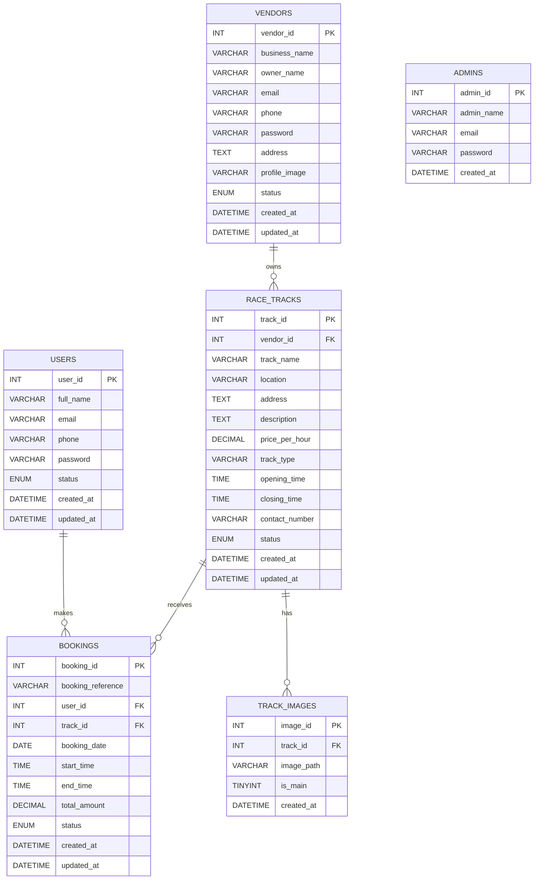

# INITIAL-D Entity Relationship Diagram

## 1. Introduction

An Entity Relationship Diagram, also called an ER Diagram, is a visual representation of database tables and the relationships between them.

In an ER Diagram, each table is called an entity. The connections between tables show how data in one table is related to data in another table.

ER Diagrams are important because they help us understand the database structure before writing SQL. They make it easier to identify primary keys, foreign keys, and relationships between tables.

We create the ER Diagram before writing SQL so that the database design is clear, logical, and easy to explain. This reduces mistakes when creating tables later.

## 2. Database Entities

The INITIAL-D database contains six main entities:

1. `users`
2. `vendors`
3. `admins`
4. `race_tracks`
5. `track_images`
6. `bookings`

## 2.1 users

The `users` entity stores customer account details.

Users can register, login, search race tracks, book race tracks, and view their booking history.

## 2.2 vendors

The `vendors` entity stores vendor account and business details.

Vendors are responsible for adding race tracks and managing booking requests for their tracks.

## 2.3 admins

The `admins` entity stores admin login details.

Admins manage the platform by monitoring users, vendors, race tracks, and bookings.

## 2.4 race_tracks

The `race_tracks` entity stores details about race tracks listed on the website.

Each race track belongs to one vendor and can be booked by users after admin approval.

## 2.5 track_images

The `track_images` entity stores image paths for race tracks.

It is stored separately because one race track can have multiple images.

## 2.6 bookings

The `bookings` entity stores booking records made by users.

It connects users with race tracks and helps vendors manage booking requests.

## 3. Entity Relationship Diagram

## A. ASCII Diagram

```text
                 +----------------+
                 |    vendors     |
                 |  vendor_id PK  |
                 +----------------+
                         |
                         | 1
                         |
                         | owns
                         |
                         | Many
                         v
                 +----------------+
                 |  race_tracks   |
                 |  track_id PK   |
                 |  vendor_id FK  |
                 +----------------+
                    |          |
                    | 1        | 1
                    |          |
                    | has      | receives
                    |          |
                    | Many     | Many
                    v          v
        +----------------+   +----------------+
        |  track_images  |   |    bookings    |
        |  image_id PK   |   |  booking_id PK |
        |  track_id FK   |   |  user_id FK    |
        +----------------+   |  track_id FK   |
                             +----------------+
                                      ^
                                      |
                                      | Many
                                      |
                                      | makes
                                      |
                                      | 1
                              +----------------+
                              |     users      |
                              |   user_id PK   |
                              +----------------+

                 +----------------+
                 |     admins     |
                 |   admin_id PK  |
                 +----------------+
                         |
                         |
                         v
        Admin manages users, vendors, race tracks, and bookings
        through application pages. No direct foreign key is required.
```

## B. Mermaid ER Diagram



## 4. Cardinality

Cardinality means the number of records that can be related between two tables.

## 4.1 Vendors to Race Tracks

Relationship:

```text
vendors 1 ---- Many race_tracks
```

This is a One-to-Many relationship.

One vendor can own many race tracks. But each race track belongs to only one vendor.

This is why `vendor_id` is stored as a foreign key in the `race_tracks` table.

## 4.2 Race Tracks to Track Images

Relationship:

```text
race_tracks 1 ---- Many track_images
```

This is a One-to-Many relationship.

One race track can have many images. But each image belongs to only one race track.

This is why `track_id` is stored as a foreign key in the `track_images` table.

## 4.3 Users to Bookings

Relationship:

```text
users 1 ---- Many bookings
```

This is a One-to-Many relationship.

One user can make many bookings. But each booking is made by only one user.

This is why `user_id` is stored as a foreign key in the `bookings` table.

## 4.4 Race Tracks to Bookings

Relationship:

```text
race_tracks 1 ---- Many bookings
```

This is a One-to-Many relationship.

One race track can receive many bookings. But each booking is for only one race track.

This is why `track_id` is stored as a foreign key in the `bookings` table.

## 5. Relationship Explanation

## 5.1 Vendors and Race Tracks

This relationship exists because vendors are the owners or managers of race tracks.

The foreign key is `vendor_id` in the `race_tracks` table.

Without this relationship, the system would not know which vendor added or manages a particular race track.

This relationship supports vendor features such as adding tracks, editing tracks, deleting tracks, and viewing bookings for their own tracks.

## 5.2 Race Tracks and Track Images

This relationship exists because each race track can have one or more images.

The foreign key is `track_id` in the `track_images` table.

Without this relationship, images would not be connected to the correct race track.

This relationship supports features like showing track thumbnails, gallery images, and track detail images.

## 5.3 Users and Bookings

This relationship exists because users create bookings.

The foreign key is `user_id` in the `bookings` table.

Without this relationship, the system would not know which user made a booking.

This relationship supports user features such as booking history and booking cancellation.

## 5.4 Race Tracks and Bookings

This relationship exists because every booking must be connected to a race track.

The foreign key is `track_id` in the `bookings` table.

Without this relationship, a booking would not show which race track was booked.

This relationship supports booking management for users, vendors, and admin.

## 5.5 Admin and Other Tables

The `admins` table does not have a direct foreign key relationship with the other tables in the first version.

Admin manages records through application pages, such as approving vendors, approving race tracks, blocking users, and monitoring bookings.

Keeping admin separate makes the design simpler and easier to explain.

## 6. Database Flow

The main flow of information in INITIAL-D is:

```text
User
  |
  v
Booking
  |
  v
Race Track
  |
  v
Vendor
```

A user searches for an approved race track and creates a booking.

The booking record stores the selected user and the selected race track.

The race track record stores the vendor who owns or manages that race track.

Because of this flow, the system can answer important questions:

- Which user made the booking?
- Which race track was booked?
- Which vendor owns that race track?
- What is the status of the booking?

Admin manages the complete system:

```text
Admin
  |
  v
Users, Vendors, Race Tracks, Bookings
```

Admin can monitor and manage all major records from the application.

## 7. Viva Questions and Answers

### 1. What is an entity?

An entity is a real-world object or concept that we store in the database. In this project, examples of entities are `users`, `vendors`, `race_tracks`, and `bookings`.

### 2. What is a relationship?

A relationship shows how two entities are connected. For example, a vendor owns race tracks, so there is a relationship between `vendors` and `race_tracks`.

### 3. What is cardinality?

Cardinality describes how many records in one table can be related to records in another table. For example, one vendor can have many race tracks, so it is a One-to-Many relationship.

### 4. What is a primary key?

A primary key is a column that uniquely identifies each record in a table. For example, `user_id` uniquely identifies each user.

### 5. What is a foreign key?

A foreign key is a column that connects one table to another table. For example, `vendor_id` in the `race_tracks` table connects a race track to a vendor.

### 6. Why is `track_images` stored in a separate table?

`track_images` is stored separately because one race track can have multiple images. If image columns were stored directly in the `race_tracks` table, the design would become less flexible.

### 7. Why are `users`, `vendors`, and `admins` stored in separate tables?

They are stored separately because each role has different responsibilities and different required data. Users book tracks, vendors manage tracks, and admins manage the system.

### 8. Why did you not create a payments table?

A payments table was not created because payment handling is kept simple in the first version. For this MCA Mini Project, payment can be treated as offline or handled at the venue.

### 9. Why is the `bookings` table important?

The `bookings` table is important because it connects users with race tracks. It stores booking date, time, amount, and booking status.

### 10. Why did you choose One-to-Many relationships?

One-to-Many relationships match the real-world behavior of the system. One vendor can own many tracks, one track can have many images, one user can make many bookings, and one track can receive many bookings.

### 11. Which table contains the foreign key for vendor and track relationship?

The `race_tracks` table contains the foreign key `vendor_id`. This connects each race track to the vendor who owns it.

### 12. Which table connects users and race tracks?

The `bookings` table connects users and race tracks. It contains both `user_id` and `track_id` as foreign keys.

### 13. Why does the admin table not have foreign keys?

The admin table is used for admin login. Admin can manage other records through application logic, so direct foreign keys are not needed in the beginner version.

### 14. What happens if foreign keys are not used?

Without foreign keys, the database may contain incorrect or disconnected data. For example, a booking could refer to a user or race track that does not exist.

### 15. How does this ER design help in writing SQL?

This ER design shows the tables, keys, and relationships clearly. Because of this, writing SQL table creation statements becomes easier and less error-prone.

## 8. Conclusion

The ER design for INITIAL-D is simple, professional, and suitable for an MCA Mini Project.

It clearly separates users, vendors, admins, race tracks, track images, and bookings into different tables.

The relationships are easy to understand and match the real-world flow of the website.

This ER Diagram will help in creating the SQL database structure correctly in the next step.
